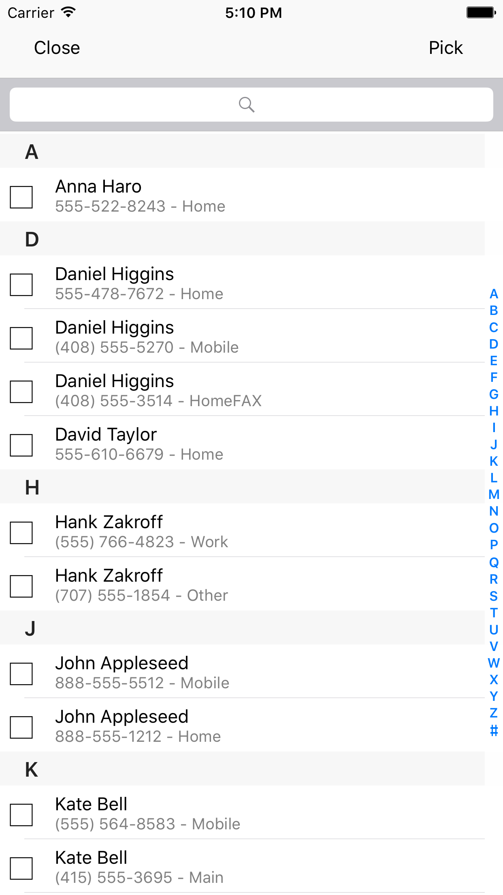
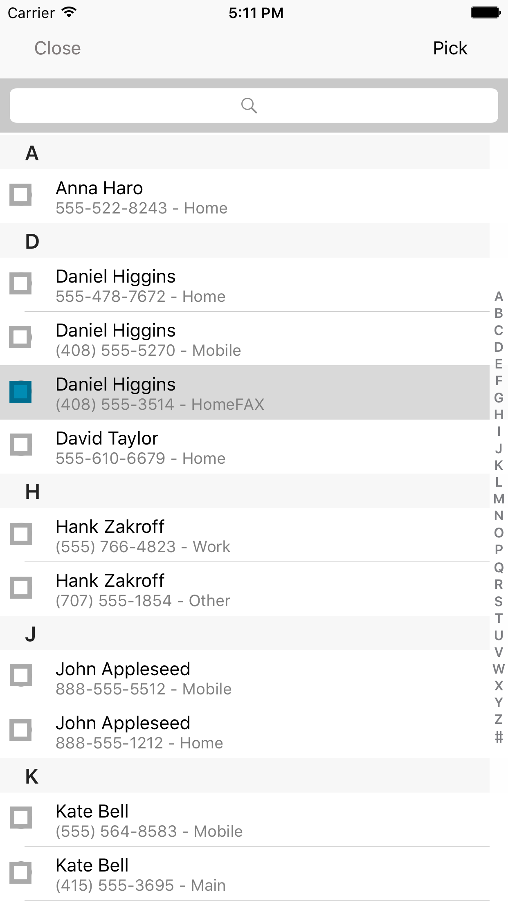

# AVContactPickerController
===========================

note: supports Xcode 8/Swift 3

Contact picker controller with Contacts framework in Swift 3

## Getting Started

Download `AVContactPickerController` and add this to your target folder.

## Usage

Add the following lines to the required class(`AVContactPickerController` will present from current visible view controller of the `Appdelegate Window` ):

To pick Single contact from Contacts, you can use:
```
 AVContactPickerController.present(title: "Contact", maximumContactCount: nil, updateDesign: nil)
 ```
 
 Alternatively, to get number of contacts, you can give maximum number of contacts in `maximumContactCount` parameter:
 ```
 AVContactPickerController.present(title: "Contact", maximumContactCount: 2, updateDesign: nil)
 ```
 
 
 
 You can edit `AVContactPickerController` design as your wish, for example:
 ```
 AVContactPickerController.present(title: "Contact", maximumContactCount: 2, updateDesign: { controller in
            
            controller.checkImage = #imageLiteral(resourceName: "check")
            controller.uncheckImage = #imageLiteral(resourceName: "uncheck")
            controller.closeButton.setTitleColor(UIColor.red, for: .normal)
        })
 ```
 You can change `checkImage` and `uncheckImage`.
 
 
 
 You can get the picked contacts from the delegate `AVContactPickerDelegate`(need not to assign delegate, delegate will assign to current visible view controller of the `Appdelegate Window`):
 ````
 extension ViewController: AVContactPickerDelegate {
    
    func pickedContacts(contacts: [Contact]) {
        for contact in contacts {
            print("\(contact.name), \(contact.mobile)")
        }
    }
}
``````

 
 License
-------
AVContactPickerController is licensed under the terms of the MIT License, see the included LICENSE file.


Author
-------
- [VinupriyaArivazhagan](https://genericswift.wordpress.com/)
